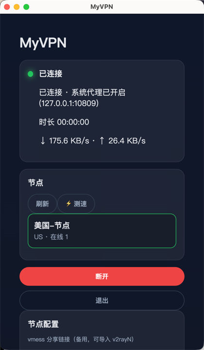
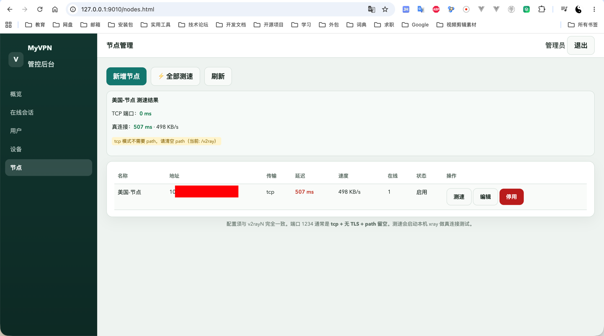
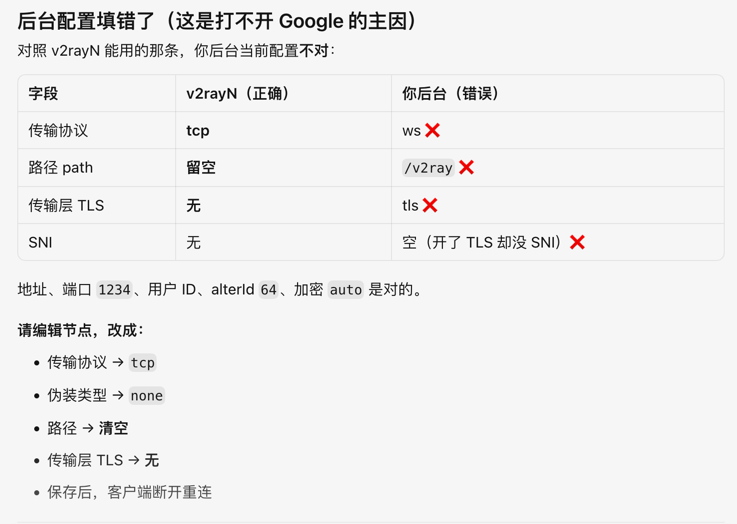

# MyVPN 管控平台

类似快连的 VPN 客户端 + 后台管控系统。基于 Spring Boot 3.5 + MySQL + Redis + Vue3 Electron。

# 部署搭建VPN服务器

参见 `docs/安装VPN.md`




管理后台配置方法


配置方法与v2ray客户端相同

## 架构

```
Electron 客户端 ──心跳/连接──► Spring Boot API ──► MySQL（用户/设备/会话/节点）
                                    │
                                    └──► Redis（在线状态、踢下线指令）
管理后台 static ──► /api/admin/*
```

## 数据库

执行 `docs/schema.sql` 或启动后端自动 `SchemaInit` 建表。

核心表：`vpn_user`、`vpn_device`、`vpn_node`、`vpn_session`、`vpn_user_session`、`vpn_admin`

## 启动后端

```bash
# 配置 MySQL / Redis（application.yml 或环境变量 MYSQL_PASSWORD、REDIS_PASSWORD）
mvn spring-boot:run
```

- API: http://127.0.0.1:9010
- 管理后台: http://127.0.0.1:9010/login.html
- 默认管理员: `admin` / `admin123`

## 管理后台功能

- 概览：在线人数、节点分布
- 在线会话：连接时长、上下行速度、**强制断开**
- 用户/设备：**启用禁用**（禁用设备会踢下线）
- 节点：启用停用、查看每节点在线数

## 桌面客户端

```bash
cd vpn-vue3-desktop
npm install
npm run dev
```

客户端流程：登录 → 拉节点列表 → 连接 → 每 15 秒心跳上报速度与流量 → 后台可 KICK。

> 当前版本已打通**管控链路**（会话、心跳、踢下线）。xray/v2ray 核心启动需将 `connect` 返回的 `v2rayConfig` / `shareLink` 接入本地子进程（可后续集成 xray-core）。

## 客户端 API

| 接口 | 说明 |
|---|---|
| POST /api/client/register | 注册 |
| POST /api/client/login | 登录（带 deviceUuid） |
| GET /api/client/nodes | 节点列表 |
| POST /api/client/connect | 建立会话，返回 v2ray 配置 |
| POST /api/client/heartbeat | 上报速度，轮询 KICK 指令 |
| POST /api/client/disconnect | 主动断开 |

## v2ray 节点配置

在管理后台「节点」或数据库 `vpn_node` 中填写与你美国服务器一致的 host/port/path/uuid 等。
每台设备有独立 `v2ray_uuid`，需在 v2ray 服务端配置多用户或使用 API 同步（可扩展）。

## 注意

- 用户要求 Spring Boot 4：当前使用 **Spring Boot 3.5.5**（与生态兼容）；升级 SB4 后可替换 parent 版本。
- 生产环境请修改默认管理员密码与数据库口令。
